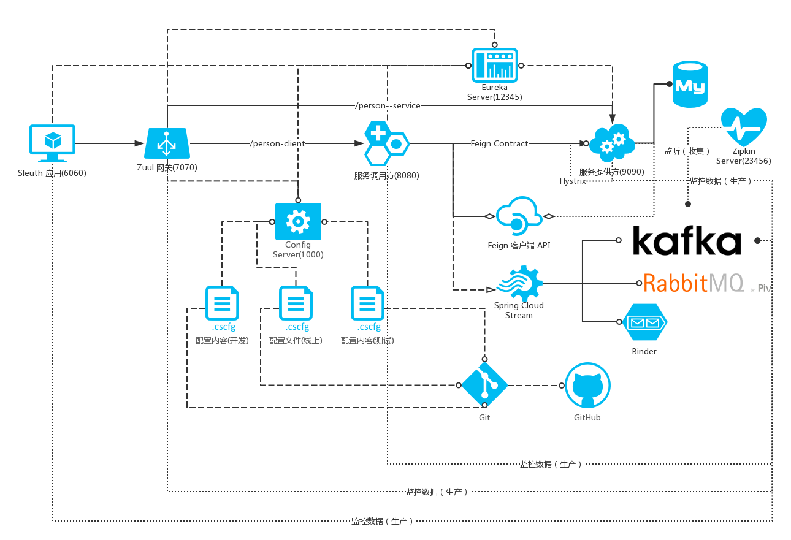

# Spring Boot + Spring Cloud 整体回顾




## Spring Boot

### JPA


#### JPA

Java 持久化的标准

Java Persistence API

> Hibernate Session#save

EntityManager#persit

EJB3.0 JPA 1.0

Hibernate

##### 定义实体

```java
package com.gupao.spring.cloud.feign.person.service.provider.entity;

import javax.persistence.*;

/**
 * Person 实体
 *
 * @author 小马哥 QQ 1191971402
 * @copyright 咕泡学院出品
 * @since 2017/11/19
 */
@Entity
@Table(name = "persons")
public class Person {

    @Id
    @GeneratedValue
    private Long id;

    @Column
    private String name;

    public Long getId() {
        return id;
    }

    public void setId(Long id) {
        this.id = id;
    }

    public String getName() {
        return name;
    }

    public void setName(String name) {
        this.name = name;
    }
}
```


##### 注入`EntityManager` 到服务层

```java
package com.gupao.spring.cloud.feign.person.service.provider.service;

import com.gupao.spring.cloud.feign.person.service.provider.entity.Person;
import org.springframework.stereotype.Service;

import javax.persistence.EntityManager;
import javax.persistence.PersistenceContext;

/**
 * {@link Person} 服务
 *
 * @author 小马哥 QQ 1191971402
 * @copyright 咕泡学院出品
 * @since 2017/11/19
 */
@Service
public class PersonService {

    /**
     * 通过标准的JPA的方式注入
     */
    @PersistenceContext
    private EntityManager entityManager;

    /**
     * 存储 {@link Person}
     * @param person
     */
    public void save(Person person) {
        entityManager.persist(person);
    }

}
```


##### 配置 JPA 数据源

```properties
## 增加 MySQL 数据源(DataSource)
spring.datasource.driverClassName = com.mysql.jdbc.Driver
spring.datasource.url = jdbc:mysql://localhost:3306/test
spring.datasource.username = root
spring.datasource.password = 123456
```


##### 增加 MySQL JDBC 驱动依赖

```xml
<dependency>
    <groupId>mysql</groupId>
    <artifactId>mysql-connector-java</artifactId>
    <scope>runtime</scope>
</dependency>
```


##### 通过 JPA 自动创建表

```properties
## 配置 JPA 行为
spring.jpa.generateDdl = true
spring.jpa.showSql = true
```


##### 定义 Person 仓储接口

```java
@Repository
public interface PersonRepository extends PagingAndSortingRepository<Person,Long>{
}
```


##### 实现 Person 分页算法

```java
    @GetMapping("/person/list")
    public Page<Person> list(Pageable pageable){
        return personRepository.findAll(pageable);
    }
```


#### Spring Data JPA

#### Spring Boot JPA


## Spring Cloud 


### [监控](http://git.gupaoedu.com/vip/xiaomage-space/tree/master/VIP%E8%AF%BE/spring-cloud/lesson-10)

#### 监控信息埋点：Sleuth

##### HTTP 上报

##### sleuth-zipkin


##### Spring Cloud Stream 上报

###### Rabbit MQ Binder

###### Kafka Binder


#### 监控信息接受：Zipkin

##### 通过 HTTP 收集

##### sleuth-zipkin


##### [Spring Cloud Stream](http://git.gupaoedu.com/vip/xiaomage-space/tree/master/VIP%E8%AF%BE/spring-cloud/lesson-9) 收集

###### Rabbit MQ Binder

###### [Kafka](http://git.gupaoedu.com/vip/xiaomage-space/tree/master/VIP%E8%AF%BE/spring-cloud/lesson-8) Binder


##### 日志收集

###### ELK

日志格式调整，从普通单行日志，变成 JSON 格式（Base on ElasticSearch）。


### [限流](http://git.gupaoedu.com/vip/xiaomage-space/tree/master/VIP%E8%AF%BE/spring-cloud/lesson-5)

#### Hystrix

`@HystrixCommand`

`HystrixCommand`

管理平台：**hystrix-dashboard**

##### 数据聚合：Turbine


### 分布式配置

#### [Spring Cloud Config 客户端](http://git.gupaoedu.com/vip/xiaomage-space/tree/master/VIP%E8%AF%BE/spring-cloud/lesson-1)

#### 直接连接方式

#### 利用 Discovery Client


#### [Spring Cloud Config 服务端](http://git.gupaoedu.com/vip/xiaomage-space/tree/master/VIP%E8%AF%BE/spring-cloud/lesson-2)

利用 Discovery Client 让其他配置客户端，发现服务端

##### Git Base 实现

##### Consul 实现

##### Zookeeper 实现


### [服务网关](http://git.gupaoedu.com/vip/xiaomage-space/tree/master/VIP%E8%AF%BE/spring-cloud/lesson-7)

#### Zuul

Zuul 类似于 `Filter` 或者 `Servlet`


### [服务治理](http://git.gupaoedu.com/vip/xiaomage-space/tree/master/VIP%E8%AF%BE/spring-cloud/lesson-3)

#### Eureka 客户端

#### Eureka 服务端


## 问答部分

* springBoot 和springCound区别和联

  答：Spring Framework，封装了大多数 Java EE 标准技术以及开源实现方法，提高生成力。不过 Spring 应用需要配置的相关组件，Spring Boot 帮助简化了配置步骤，采用默认的配置能够快速的启动或者构建一个Java EE 应用。Spring Boot 单机应用，Spring Cloud 是将 Spring Boot 变成云应用，那么里面需要增强一些组件，监控、限流、服务注册和发现等等。

* springData-jpa和JTA持久化框架区别

  答：JTA 主要关注分布式事务，事务操作背后可能资源是 数据库、消息、或者缓存等等。

  从数据库角度，JTA 使用 JPA作为存储，但是可以使用 JDBC。JTA 还能操作 JMS。

* feign 和 ribbon 区别?feign内部实现依靠的是ribbon的嘛?

  答：Feign 作为声明式客户端调用，Ribbon 主要负责负载均衡。Feign 可以整合 Ribbon，但是不是强依赖。Spring Cloud 对 Feign  增强，Feign 原始不支持 Spring WebMVC，而是支持标准 JAX-RS（Rest 标准）

* 整合图，zuul 换成 nginx ，nginx应该怎么配置才能使用sleuth,从网关开始监控？

  答：nginx 需要增加 HTTP 上报监控信息到 Zipkin Server

* spring-data-jpa里面有个地方我觉得特别不好用，就是实现Repository的实现。比如写了一个接口，里面有方法findByFieldAAndFieldB(String fieldA, String fieldB)，如果fieldA或者fieldB是null，data-jpa的实现是当你select * from table where field_a = fied_a and field_b is null。这在做查询的时候特别不好用，大部分情况下都是希望是select * from table where field_a = field_a。除了用JpaSpecificationExecutor有没有别的方法？因为去写Specification太麻烦了。

  答：我采用Native SQL 处理。

* SpringCloud 服务治理能和dubbo共存，或者替换成dubbo吗

  答：这个问题在社区里面有人问题，目前暂时没有确定答复。

* 想和mybatis一样，可以根据条件生成不同的sql?

  答：Spring Data JPA 不太好实现，满足90%的CRUD 需求。

* 记得在原生MyBatis的mapper.xml文件中可以使用标签来判断是不是为null。如果是null的话就会舍弃该查询字段。

  答：MyBatis 里面 Mapper.xml 可以增加 if 或者for each 这样的语句

* spring-data-jpa-reactive里面的实现为什么方法的返回值不能使用Page了？比如接口只能声明Flux<T> findAll(Pageable pageable)而不能使用Page<T> findAll(Pageable pageable)或者Mono<Page<T>> findAll(Pageable pageable)

  答：Reactive 是推模式，所以被动更新。Page 是 Iterable 接口，它是拉的模式，如果在reactive 中返回Page ，那么违反了设计的初中。

* spring boot 和spring cloud,生成环境怎么部署比较好，是直接java 运行还是放到tomcat中间件里统一启动？

  答：直接通过 java 或者 jar 命令启动

* 刚才小马哥讲的JPA分页查询，他实现的是页面全部刷新还是局部刷新？类似于ajax做分页查询

  答：全量更新，查询数据库。

* 使用spring cloud这一套框架，怎么进行API鉴权，认证成功的用户信息怎么保存，各个微服务的数据状态又怎么保存

  答：Spring Security OAuth2 验证，Spring Session 管理用户状态，会话状态，不需要长期保存，在短时间内保存，比如 Spring Session + Redis（30分钟）。

* Spring Security 为什么不能跨版本使用

  答：Spring Security 兼容不是特别好，一般建议统一版本。

* Shiro 和 Spring Security 的区别？

  答：Shiro 是纯后端的安全校验和认证框架，Spring Security 是前端 + 后端安全校验和认证框架。

* POJO可以和JPA解耦么，annotation往往还得引入hb？除了xml配置。耦合得有点闹心啊？

  答：所以应该把 DTO 对象 和 Entity 解耦，不要继承也不要组合。

* 小马哥，说说你怎么区别spring（包括最近讲的）里大量注解的理解和使用？

  答：作用域来区别，职责。

  数据：JDBC、JPA、Cache、NoSQL、Message

  安全：认证和鉴别

  监控：数据埋点、数据收集

  Web：Servlet、Spring WebMVC、JAX-RS、WebSocket、WebServices

  配置：System Properties、Properties、YAML、启动参数、CSV、XML

* ​

  ​


